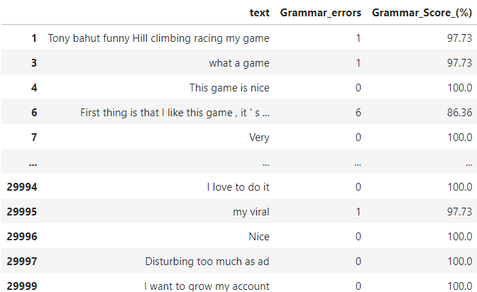
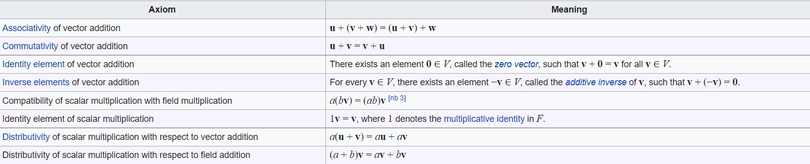

# Grammar_check_on_app_reviews
# Summary
To perform grammar check on the reviews from the given dataset using any pre-trained model or text from open datasets
# Methods
## Pre-processing
* Since we are doing grammar check on the reviews other columns are not required and hence dropped
* Checking for null values and dropping them
* Removing non english words using **nltk** library because these words can generate wrong results when checking for grammar
* Removing any empty rows after taking only english words
## Grammar check
* Calculating the number of grammatical errors in each sentence using **Language tool python** library
* Using this error to calculate accuracy(%) of a particular text
## Result

# Bonus questions
# Write about any difficult problem that you solved. (According to us difficult - is something which 90% of people would have only 10% probability in getting a similarly good solution)
The difficult problem I solved was the next question because its a tricky question and need full understanding of the theory to answer it correctly, So I had to understand the theory by studying from the internet and finally found the solution

# Formally, a vector space V' is a subspace of a vector space V if V' is a vector space every element of V′ is also an element of V. Note that ordered pairs of real numbers (a,b) a,b∈R form a vector space V. Which of the following is a subspace of V?
* The set of pairs (a, a + 1) for all real a
* The set of pairs (a, b) for all real a ≥ b
* The set of pairs (a, 2a) for all real a
* The set of pairs (a, b) for all non-negative real a,b\
So for these pairs to be subpace of V they should be also a vector space and for any pair to be vector space they must follow all these conditions

* So according to Identity element of vector addition axiom (0,0) must be a pair which is not possible for the (a,a+1) pair hence it is not a subspace
* So according to Inverse elements of vector addition axiom there must be -V which is not possible for all points in (a,b) for all real a ≥ b Example: for (3,2) there must be (-3,-2) here a<=b hence this also not a subspace
* So according to Identity element of scalar multiplication axiom (1,1) must be a pair which is not possible for (a,2a) pair hence it is not a subspace
* So according to Inverse elements of vector addition axiom there must be -V which is not possible because it only contains non negative hence it is not a subspace
## So, none of these points form a subspace
